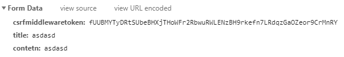

1. `python manage.py startapp articles`
   
    - 앱 생성
    
2. `models.py` 작성

    -  테이블 정의. 테이블의 구조, 스키마

    ```python
    from django.db import models
    
    # Create your models here.
    class Article(models.Model):
        # 이 컬렌의 데이터의 길이는 최대 20글자
        # 필수 인자가 필요하다.
        title = models.CharField(max_length = 20)
        # 최대 길이가 존재하지 않는 칼럼
        # 필수 인자가 없다.
        content = models.TextField()
        # auto_now_add 데이터베이스가 최초 생성 일자
        # django ORM이 최소 Insert 시에만 현재 날짜와 시간으로 갱신
        creted_at = models.DateTimeField(auto_now_add=True)
        # 마지막 업데이트 시간으로 갱신한다.
        upated_at = models.DateTimeField(auto_now=True)
    ```
    - 데이터베이스 테이블 생성 쿼리

3. `python manage.py makemigrations`

    - 작성된 models.py를 바탕으로 실제 데이터베이스에 명령을 내릴 설계도를 작성.
    - 마이그레이션 설계도 작성
    - 나중에 테이블을 수정할 일이 생겨서 새로운 DB를 만들게 되면 0001,0002 순서로 증가한다.
      - 나중에 문제 생기면 롤백하기 위한 백업- 예를 들면 0002를 지워 0001로 돌아산다.
    - 이거 자체로는 설계도만 만들 뿐 진짜 테이블을 만드는 것은 아니다.
4. `python manage.py sqlmigrate article 0001`
   
    - 해당 마이그레이션즈가 어떻게 해석되어 동작할지 확인할 수 있다.
    - 위에서 생성된 설계도를 보기만 할뿐 뭘 하는 건 아니다.
    ```
    BEGIN;
    --
    -- Create model Article
    --
    CREATE TABLE "articles_article" ("id" integer NOT NULL PRIMARY KEY AUTOINCREMENT, "title" varchar(20) NOT NULL, "contetn" text NOT NULL, "creted_at" datetime NOT NULL, "upated_at" datetime NOT NULL);
    COMMIT;
    ```
- 위의 저것은 이런 문장이 되서 출력된다.
  
5. `python manage.py migrate`
   - 작성된 migrations 파일을 바탕으로 실제 db에 쿼리문을 날림. (db 생성 및 변경사항 적용)
   - 즉, 위에서 생성된 데이터를 이용해 진짜로 데이터를 넣는 단계를 말한다.
   - db 작성, 구축
6. 확장 플러그인 `SQLite`설치

    - ctrl + p -> SQLite 실행

7. `pip install ipython` - ipython 설치

8. `python manage.py shell` - 장고 내부의 파이썬 콘솔 실행
    - 여기서 사용하는 값이 장고에 영향을 주게 된다.
    - 참고로 ctrl + L하면 clear()

9. `from articles.models import Article`를 입력한다.
    - 아티클 안의 `articles.models`를 import해온다.
    - 각각 파일 안의 모듈을 각각 import 해오려면 시간이 너무 걸린다.

10. INSTALLED_APPS =[] 안에 `'django_extensions'`을 추가한다.

11. Article테이블이 가지고 있는 칼럼 조회
     - `Article.objects.all()`입력
         - `.objects.`ORM에 관련된 매서드를 제공해 주는 역활. 즉 `objects.`이 후에 명령어를 입력해준다. 인터페이스를 연결해 주는 매니저라고 보면 된다.
         - `dir(Article.objects)`로 오브젝트에 관련된 매서드 확인 가능하다.
         - `Out[3]: <QuerySet []>`이 출력된다.
     1. `article = Article()`
         - query 호출
     2. `article.title = 'first'`
         - 타이틀엔 first
     3. `article.contetn = 'djanggo!'`
         - djanggo! 세팅
     4. `article`
         - 아무것도 안 들어 가 있다.
     5. `article.save()`
         - 위에 작성한 내용들이 이제야 저장된다.
     6. `article`
         - 들어간거 확인 가능
     7. `article.title`
         - 테이블에 title 항목을 확인 가능하다.
     8. `article.creted_at`
         - UTC로 들어가 있는걸 볼 수 있는데, 장고에서 시간을 바뀐다고 바뀌는게 아니다.
         - 타 지역에서 들어갈 수도 있기 때문에 백엔드는 무조건 UTC로 하자.
     9. `article = Article(title='second',contetn = 'djanggo!!')`
         - 두번째 방법
         - 아예 넣은 다음에 저장하는 방법
     10. `article.save()`
         - 물론 세이브도 함
     11. `Article.objects.create(title='third',contetn='django!!')`
         - 세번째 방법
         - 아예 인스턴스를 안만들고 저장하다보니 저장도 안하고 바로 return 된다.
         - 리턴값 `<Article: Article object (3)>`

12. 칼럼 수정

13. `article = Article.objects.get(pk=1)`

14. `article.title = 'edit title'`

15. `article.save()`

16. 칼럼 삭제

17. `article = Article.objects.get(pk=1)`

18. `article.delete()`

     - 다음에 다시 데이터 베이스에 넣으면 6번에 들어간다.

## 참고
https://docs.djangoproject.com/en/3.0/ref/models/querysets/

#### Objects
- models.py에 작성한 클래스를 불러와서 사용할 때 DB와의 인터페이스 역활을 하는 manager
- Python class ----- object ---- dbsql

#### QuerySet
- objects 매니저를 사용하여 복수의 데이터를 가져오는 함수를 사용할때 반환되는 객체 타입
- 단일 객체는 Query(class의 인스턴스로 반환)
- query(질문)을 DB에 보내서 글을 조회하거나 생성, 수정, 삭제
- query를 보내는 언어를 활용하여 DB에게 데이터에 대한 조작을 실행

#### Read
``` python
# 모든 객체 전체 조회
Article.objects.all()
```
```python
# 특정 객체 조회
Article.objects.get(pk=1)
```
- get()을 사용할 때 해당 객체가 없으면 DoesNotExist에러가 발생
- 여러개일 경우에는 Multiple
```python
Article.objects.filter(title='first')
# <QuerySet [<Article: Article object (1)>]>
Article.objects.filter(title='firsaaaaaa')
# <QuerySet []>
```
- 필터는 무조건 쿼리 셋(리스트)을 리턴한다.
``` python
#Like
# title에 fi가 포함된 쿼리 셋을 출력
Article.objects.filter(title__contains='fi')
# title에 fi로 시작되는 쿼리 셋을 출력
Article.objects.filter(title__startswith='fi')
# title에 !로 끝나는 쿼리 셋을 출력
Article.objects.filter(title__endswith='!')
# title에 Fi(소문자도 포함)가 포함된 쿼리 셋을 출력
Article.objects.filter(title__icontains='Fi')
```

``` python
Article.objects.order_by('pk')
# 쿼리 문을 pk기준으로 정순으로 출력한다.
Article.objects.order_by('-pk')
# 쿼리 문을 pk기준으로 역순으로 출력한다.
```
#### Create
``` python
# 1
article = Article()
article.title = 'first'
article.contetn = 'djanggo!'
article
article.save()
```
```python
#2 
article = Article(title='second',contetn = 'djanggo!!')
article.save()
```
```python
#3
Article.objects.create(title='third',contetn='django!!')
```

#### Update
```python
article = Article(pk='1')
article.title = 'happy'
article.contetn = 'django!!'
article.save()
```

#### Delete
```python
article = Article(pk='1')
article.delete()
```

### Create
1. 필요한 View 함수는 2개
    - new / create

### POST
- 사용자는 Django에게 'html 파일줘(GET)'가 아니라 '~한 레코드(글)을 생성해줘!(POST)'이기 때문에 http method post를 사용해야한다.
- 데이터는 url에 직접 노출되서는 안된다. 우리가 url에 접근하는 방식은 모두 GET요청/ Query의 형태를 통해 DB구조 유추할 수 있고 이는 보안적인 측면에서 매우 취약하다.
- DB를 조작하는 친구근 GET이 아닌 POST! 왜? 중요한 요청이기 때문에 최소한 신원 확인이 필요.

- GET에 사용했던 방식을 그대로 사용하면 에러가 발생
    - CSRF 검증에 실패했습니다. 요청을 중단하였습니다.
    - `settings.py`의 `MIDDLEWARE`의 `'django.middleware.csrf.CsrfViewMiddleware'` 부분이다.
- form 태그에 ``값을 줘야한다.
    - 예를 들면
    ``` django
    <form action="" method = "POST">
        
        <input type="text" name= "title"><br>
        <textarea name= "contetn"></textarea><br>
        <button class="btn btn-primary">작성</button>
    </form>
    ```
- 콘솔창의 네트워크 탭으로 들어가면 csrf를 보낸 것을 볼 수 있다.
    

### Delete 
- 삭제의 경우에도 단순히 GET으로 보내면 삭제 되는 경우를 방지하기 위해
    ``` dajango
        <form action="" method = "POST">
            
            {# 단 이래도 주소값으로 바로 보내는 형식이면 삭제가 된다. 받는 형식이 GET도 받기 때문에 #}
            <button>삭제</button>
        </form>
    ```
- 그리고 매서드도 POST만 수신하도록 만든다.
    ```python
        def delete(request, pk):
        if request.method == 'POST' :
            article = Article.objects. get(pk=pk)
            article.delete()
            return redirect('articles:index')
        else :
            return redirect('articles:detail',pk)
    ```
### UPDATE(EDIT)
- EDIT
- Update
